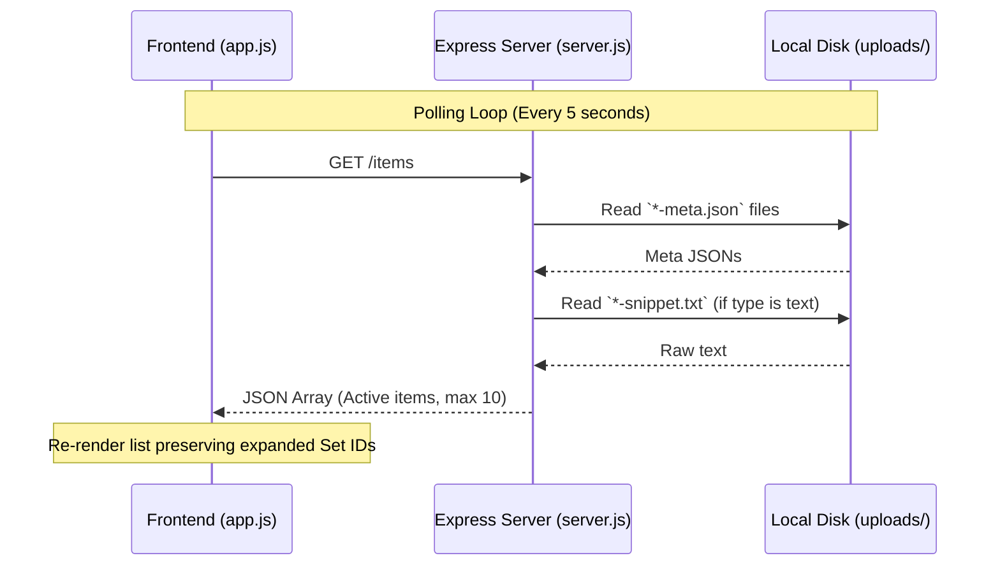

# Design: History and Theme Switch

## Technical Approach

Introduce a persistent light/dark mode and a dynamic, auto-refreshing history list of active file/text uploads. The server will expose a `GET /items` endpoint. The client will query it every 5 seconds, rendering active uploads and preserving snippet expansion states using a Javascript `Set` of active IDs. CSS custom properties will be refactored on `:root` to support overrides under `body.dark-mode` and fix mobile viewport widths.

## Architecture Decisions

### Decision: Server-side on-demand uploads directory scanning

| Option | Tradeoff | Decision |
|--------|----------|----------|
| **In-Memory Cache** | Speed; potential state mismatch on server crash. | **On-demand Directory Scan** |
| **On-demand Scan** | Higher I/O; clean, stateless, and naturally handles file updates. | Scan `uploads/` directory on every request, filtering out expired metadata. |

**Rationale**: Since uploads naturally expire after 24 hours, the active uploads directory is small. On-demand scanning avoids complex synchronization logic and handles expired deletions gracefully.

### Decision: State preservation via Local Client Set

| Option | Tradeoff | Decision |
|--------|----------|----------|
| **Naive Re-render** | Simple; collapses user's open snippets on poll (poor UX). | **ID Set State Tracking** |
| **ID Set State Tracking** | Minor client overhead; preserves UX across 5-second polls. | Track expanded text snippets in a local `Set`. Apply state on redraw. |

**Rationale**: Polling should not interrupt user interaction. Storing active IDs maintains the visual state seamlessly.

## Data Flow



## File Changes

| File | Action | Description |
|------|--------|-------------|
| [server.js](file:///C:/Users/Win10/Desktop/Programacion/Dev/TaPeer/server.js) | Modify | Implement `GET /items` filtering by active metadata and fetching snippet content. |
| [public/index.html](file:///C:/Users/Win10/Desktop/Programacion/Dev/TaPeer/public/index.html) | Modify | Add Theme toggle button and clipboard history section markup. |
| [public/style.css](file:///C:/Users/Win10/Desktop/Programacion/Dev/TaPeer/public/style.css) | Modify | Define CSS Variables on `:root`, dark-mode overrides, responsive fixes for mascot/container. |
| [public/app.js](file:///C:/Users/Win10/Desktop/Programacion/Dev/TaPeer/public/app.js) | Modify | Add theme toggle persistence, 5s setInterval polling, and list re-rendering with state preservation. |

## Interfaces / Contracts

### Get Shared Items
- **Signature**: `GET /items`
- **Response (200 JSON)**:
  ```json
  [
    {
      "id": "uuid-v4-string",
      "originalName": "uuid-v4-string-snippet.txt",
      "mimeType": "text/plain",
      "size": 120,
      "uploadTime": 1783344000000,
      "expiryTime": 1783387200000,
      "type": "text",
      "snippetUrl": "/snippet/uuid-v4-string",
      "content": "Full snippet content..."
    }
  ]
  ```

## Testing Strategy

| Layer | What to Test | Approach |
|-------|-------------|----------|
| **Server** | `GET /items` returns active uploads sorted desc. | Perform integration tests via helper scripts checking output array count and sort order. |
| **Frontend** | Polling & Expanded Snippet Persistence. | Manually expand a text item and verify it does not collapse when the 5-second interval triggers. |
| **Theme** | Persistent Light/Dark Mode. | Toggle dark mode, refresh page, check if `body.dark-mode` is loaded from `localStorage`. |
| **Responsive**| Mobile width layout and mascot. | Resize viewport down to 320px and verify horizontal scrollbars are absent. |

## Migration / Rollout

No migration required.

## Open Questions

None.
