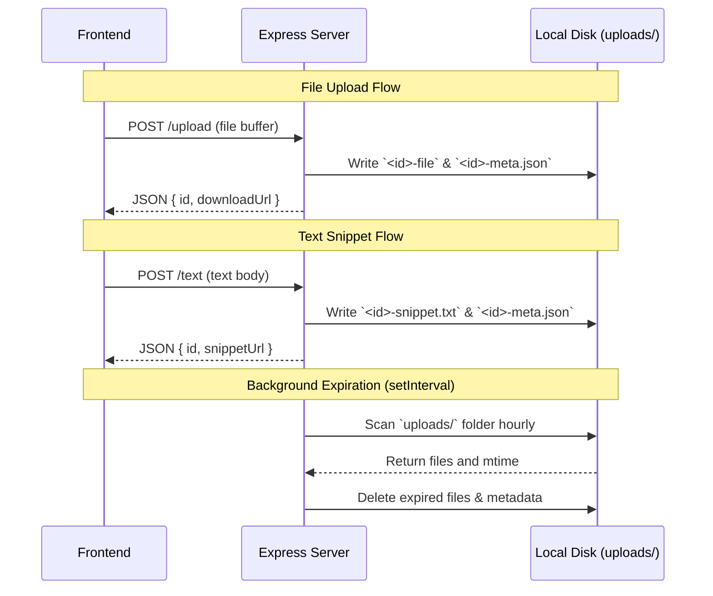

# Design: Initial Setup for TaPeer

## Technical Approach

Build a lightweight Express server using Multer for file uploads and local disk storage. Data persistence is achieved without a database by saving files directly in `uploads/` alongside metadata JSON files. The frontend is a single-page earth/jungle-themed application using CSS and vanilla JavaScript to handle drag-and-drop uploads and an interactive SVG tapir mascot. A background timer handles automatic file expiration by scanning the directory hourly and purging files older than 24 hours.

### Folder Structure
- `package.json` - Configuration and dependencies (`express`, `multer`)
- `server.js` - Server entry point, API routes, and background expiration interval
- `public/` - Web assets directory
  - `index.html` - HTML structure with inline SVG tapir and drag-and-drop zone
  - `style.css` - Jungle/earth theme palette and layout styling
  - `app.js` - Drag-and-drop handlers, API fetch calls, and quote rotation
- `uploads/` - Directory storing uploaded files, text snippets, and `-meta.json` files

### Background File Deletion
An hourly background timer (`setInterval`) reads all files in `uploads/`. For each file, `fs.promises.stat()` is called. If `Date.now() - stat.mtimeMs > 24 * 60 * 60 * 1000`, the file and its associated `-meta.json` file are deleted using `fs.promises.unlink()`.

## Architecture Decisions

### Decision: No-database metadata storage

| Option | Tradeoff | Decision |
|--------|----------|----------|
| **Local SQLite database** | Adds library dependency and schema migration overhead. | **Disk-based JSON metadata files** |
| **Disk JSON metadata files** | Slower query times but zero external dependencies or setup. | We store metadata as `<id>-meta.json` alongside `<id>-file` or `<id>-snippet.txt` in the `uploads/` directory. |

**Rationale**: Since the scope explicitly excludes database integration and requires 24-hour expiration, using file-based metadata is the simplest, lowest-overhead approach.

### Decision: Safe file streaming for downloads

| Option | Tradeoff | Decision |
|--------|----------|----------|
| **Direct express.static** | Vulnerable to XSS if users upload malicious HTML/JS. | **Forced attachment download** |
| **Forced attachment download** | Disables in-browser viewing but eliminates execution risks. | Use `res.download()` or set `Content-Disposition: attachment` for GET `/download/:id`. |

**Rationale**: Serving files with forced attachment headers mitigates the risk of arbitrary code execution in the client browser.

## Data Flow



## File Changes

| File | Action | Description |
|------|--------|-------------|
| `package.json` | Create | Configure Node.js scripts and dependencies (`express`, `multer`). |
| `server.js` | Create | Express app setup, API endpoints, background cleanup logic. |
| `uploads/` | Create | Target directory for files, snippets, and metadata. |
| `public/index.html` | Create | HTML interface with SVG tapir and drag-and-drop dropzone. |
| `public/style.css` | Create | Jungle/earth theme styling (palette: `#102A1E`, `#1D4D36`, `#F4F0EA`). |
| `public/app.js` | Create | Frontend event listeners, drag-over transitions, fetch requests, loading quotes. |

## Interfaces / Contracts

### 1. Upload File
- **Signature**: `POST /upload`
- **Request**: `multipart/form-data` with key `file`
- **Response (200 JSON)**:
  ```json
  {
    "id": "uuid-v4-string",
    "fileName": "document.pdf",
    "downloadUrl": "/download/uuid-v4-string",
    "expiryTime": 1783344000000
  }
  ```

### 2. Paste Snippet
- **Signature**: `POST /text`
- **Request (JSON)**: `{ "text": "my code snippet" }`
- **Response (200 JSON)**:
  ```json
  {
    "id": "uuid-v4-string",
    "snippetUrl": "/snippet/uuid-v4-string",
    "expiryTime": 1783344000000
  }
  ```

### 3. Download File
- **Signature**: `GET /download/:id`
- **Response**: Streams file using `res.download(filePath, originalName)` with `Content-Disposition: attachment`. Returns `404` if not found or expired.

### 4. Get Snippet
- **Signature**: `GET /snippet/:id`
- **Response (200 text/plain)**: Returns raw text content of the snippet. Returns `404` if expired.

## Testing Strategy

| Layer | What to Test | Approach |
|-------|-------------|----------|
| **Integration** | Upload file, paste snippet, check metadata existence. | Programmatic API testing using a helper test script. |
| **Functional** | Expiration logic (hourly cleanup interval). | Mock `Date.now()` or modify file `mtime` manually to trigger deletion. |
| **Frontend** | Drag events, SVG class changes, upload quote rotation. | Visual check of CSS state classes (`.drag-over`, `.uploading`, `.success`). |

## Migration / Rollout

No migration required.

## Open Questions

None.
