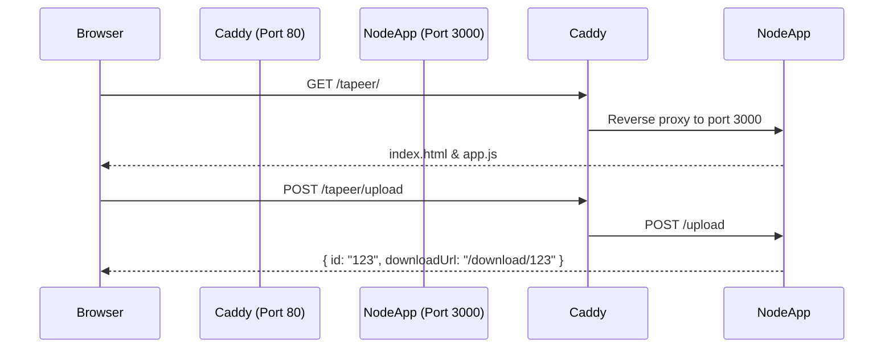

# Design: TaPeer Caddy and HTTP Fixes

## Technical Approach
Support hosting TaPeer on non-secure HTTP contexts and behind a reverse proxy subpath (`/tapeer/`) while serving a static dashboard landing page at the root (`/`). All frontend fetches, downloads, and snippet links will be converted to use relative paths. A fallback text-copy mechanism using a hidden `<textarea>` and `document.execCommand('copy')` will enable clipboard copying in non-secure HTTP environments. Automatic scrolling upon successful share will be removed to keep the tapir animation fully visible.

## Architecture Decisions

### Decision: Client-side relative path resolution

| Option | Tradeoff | Decision |
|--------|----------|----------|
| **Absolute Paths** | Simpler; breaks under reverse proxy subpath hosting. | **Relative Pathing** |
| **Relative Pathing** | Requires careful relative URL resolution. | Fetch relatively; strip leading slashes from server-returned paths; construct URLs using `new URL(path, window.location.href)`. |

**Rationale**: `new URL(path, window.location.href)` automatically retains the `/tapeer/` prefix, ensuring correct URL resolution whether index.html is present or not.

### Decision: Clipboard copy fallback for non-secure HTTP

| Option | Tradeoff | Decision |
|--------|----------|----------|
| **Navigator API only**| Simple; fails silently on HTTP (e.g. local IP, Tailscale). | **textarea Fallback** |
| **textarea Fallback** | Uses deprecated API, but works everywhere. | Fall back to `document.execCommand('copy')` using a temporary, off-screen `<textarea>`. |

**Rationale**: `navigator.clipboard` requires HTTPS. A temporary textarea allows copying on local network/Tailscale HTTP hosts.

## Data Flow


## File Changes

| File | Action | Description |
|------|--------|-------------|
| [public/app.js](file:///C:/Users/Win10/Desktop/Programacion/Dev/TaPeer/public/app.js) | Modify | Update fetches/links to relative; add clipboard fallback; remove scroll in `handleSuccess`. |
| [Caddyfile](file:///C:/Users/Win10/Desktop/Programacion/Dev/TaPeer/sdd/tapeer-caddy-and-http-fixes/Caddyfile) | New | Draft Caddyfile configuration for `/tapeer/` subpath and static dashboard. |
| [dashboard/index.html](file:///C:/Users/Win10/Desktop/Programacion/Dev/TaPeer/sdd/tapeer-caddy-and-http-fixes/dashboard/index.html) | New | Draft dashboard HTML with link to `/tapeer/`. |

## Interfaces / Contracts

### Relative Link Resolution
The `handleSuccess` function converts server-provided `/download/:id` and `/snippet/:id` absolute paths into relative paths by removing the leading slash:
```javascript
const cleanUrl = url.startsWith('/') ? url.slice(1) : url;
const fullUrl = new URL(cleanUrl, window.location.href).href;
```

### Clipboard Utility
Unified copy helper:
```javascript
function copyToClipboard(text, button) {
  const performCopy = () => {
    if (navigator.clipboard && navigator.clipboard.writeText) {
      return navigator.clipboard.writeText(text);
    }
    // Fallback for HTTP (non-secure)
    const textarea = document.createElement('textarea');
    textarea.value = text;
    textarea.style.position = 'fixed'; // Avoid scrolling
    textarea.style.opacity = '0';
    document.body.appendChild(textarea);
    textarea.select();
    try {
      document.execCommand('copy');
      return Promise.resolve();
    } catch (err) {
      return Promise.reject(err);
    } finally {
      document.body.removeChild(textarea);
    }
  };

  performCopy().then(() => {
    // Show success feedback
  }).catch(err => console.error('Copy failed', err));
}
```

## Testing Strategy

| Layer | What to Test | Approach |
|-------|-------------|----------|
| **Frontend** | Relative endpoint resolution. | Verify fetches use relative path (e.g. `upload` instead of `/upload`). |
| **Frontend** | Clipboard fallback in HTTP. | Run app under HTTP (non-secure) and verify copying share links and snippets succeeds. |
| **Frontend** | Mascot scroll behavior. | Verify that on upload success, scroll stays at the top, wiggling ears/tail are visible. |
| **Reverse Proxy** | Routing & subpath. | Load `http://localhost/tapeer/` through Caddy, verify static files load, and uploads work. |

## Migration / Rollout
No database migration required.

## Open Questions
None.
